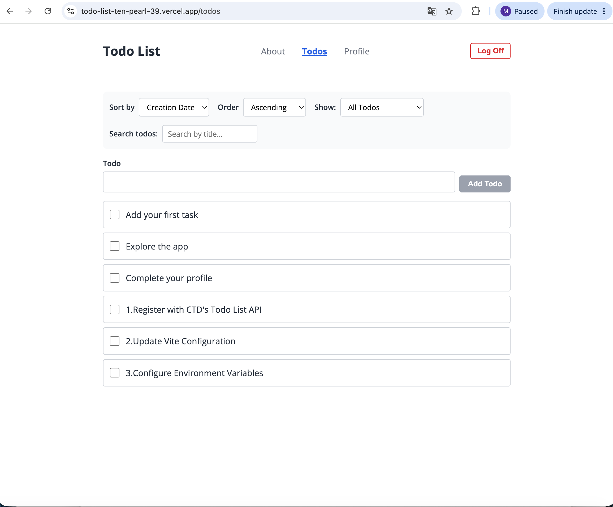

# Todo List

A full-featured task management application built with React. Users can create, edit, complete, and filter todos with a clean, responsive interface. The app includes authentication, input sanitization, and professional styling using CSS Modules.

## Live Demo

https://todo-list-ten-pearl-39.vercel.app/

## Features

- Add new todo items
- Mark todos as completed
- Edit existing todo text inline
- Delete/complete todos
- Filter todos by status (All, Active, Completed)
- Search todos by title
- Sort todos by creation date or title (ascending/descending)
- User authentication (login/logout)
- Protected routes for authenticated users
- Profile page with todo statistics and completion rate
- Input validation and sanitization with DOMPurify
- Responsive design for mobile, tablet, and desktop
- Loading, error, and empty states

## Technologies Used

- [React](https://react.dev/) 19
- [React Router](https://reactrouter.com/) 7
- [Vite](https://vite.dev/) 8
- [CSS Modules](https://github.com/css-modules/css-modules) for scoped component styling
- [DOMPurify](https://github.com/cure53/DOMPurify) for input sanitization
- [Open Sans](https://fonts.google.com/specimen/Open+Sans) (Google Fonts)
- [Vercel](https://vercel.com/) for deployment

## Screenshots



## Getting Started

### Prerequisites

- Node.js (v18 or higher)
- npm

### Installation

```bash
git clone https://github.com/Yuhan-Kong/todo-list.git
cd todo-list
npm install
```

### Environment Variables

Create a `.env` file in the project root:

```
VITE_TARGET=https://ctd-learns-node-l42tx.ondigitalocean.app
```

## Available Scripts

| Script | Description |
|--------|-------------|
| `npm run dev` | Start development server on http://localhost:3001 |
| `npm run build` | Build for production (output in `dist/`) |
| `npm run preview` | Preview the production build locally |
| `npm run lint` | Run ESLint to check code quality |

## Design Decisions

### Styling: CSS Modules

I chose **CSS Modules** for styling because:

- **Scoped by default**: Each component gets unique class names at build time, preventing naming conflicts across components. For example, `.button` in `TodoForm.module.css` and `.button` in `LoginPage.module.css` are completely independent.
- **Familiar CSS syntax**: No need to learn a new API — it uses standard CSS with the benefit of automatic scoping.
- **Zero configuration**: Vite supports CSS Modules out of the box. Any file ending in `.module.css` is automatically treated as a CSS Module.
- **Lightweight**: No additional runtime dependencies, unlike CSS-in-JS solutions.

### Color Scheme

- Primary: Blue (#2563eb) for interactive elements (buttons, links, active states)
- Error: Red (#dc2626) for error messages and destructive actions
- Text: Dark gray (#1f2937) on white background for readability
- Secondary text: Medium gray (#6b7280) for labels and placeholders

### Security

- All user inputs are sanitized using DOMPurify before processing
- Input validation runs before sanitization
- Maximum length limits on text inputs
- Authentication tokens are handled via httpOnly cookies

## Future Improvements

- Add unit tests for critical components
- Implement dark/light theme toggle
- Add drag and drop for reordering todos
- Add due dates and priority levels to todos

## License

MIT License

## Contact

- GitHub: [Yuhan-Kong](https://github.com/Yuhan-Kong)
